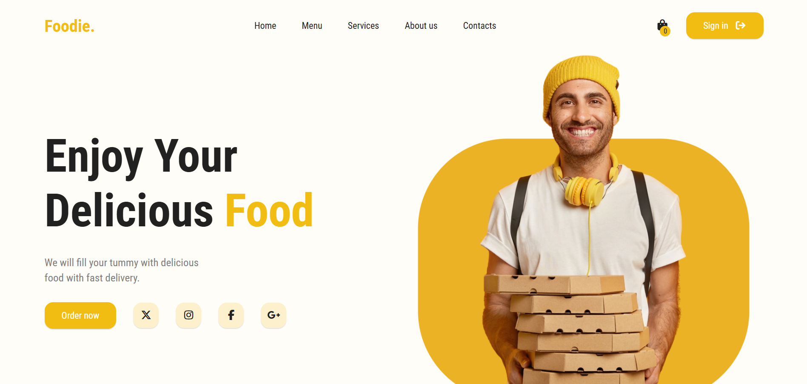
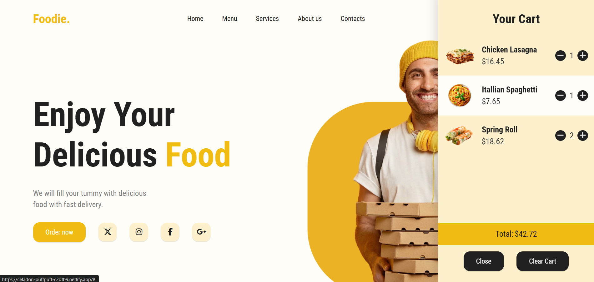
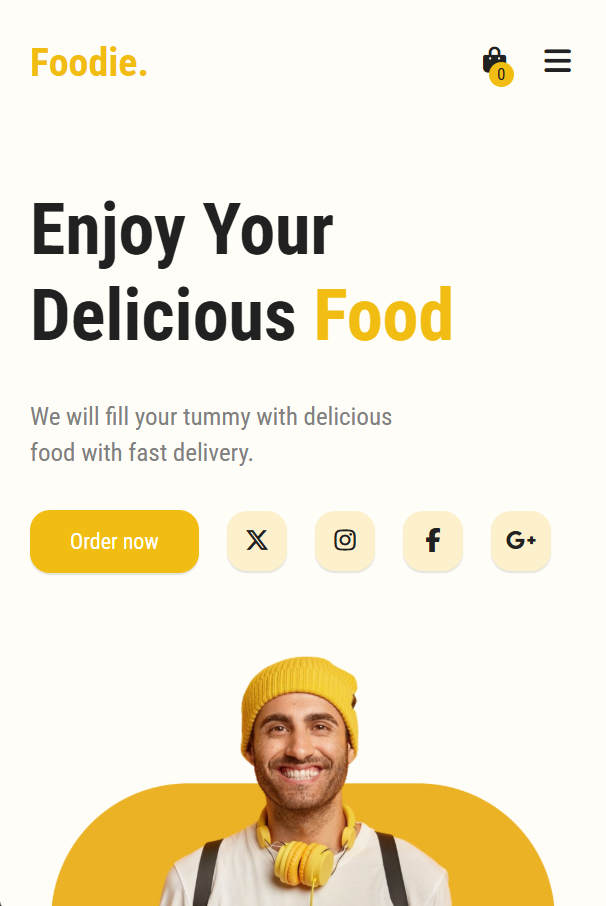

# 🍔 Foodie – Food Delivery Web App

<div align="center">

### 🚀 A modern and responsive food delivery web application built with HTML, CSS, and JavaScript.

Browse delicious meals, add items to your cart, manage quantities in real-time, and enjoy a smooth shopping experience.

</div>

---

## 📸 Screenshots

### 🏠 Home Page



### 🛒 Shopping Cart Sidebar



### 📱 Mobile Responsive Design



## ✨ Live Demo

🔗 **Demo:** celadon-puffpuff-c2dfb9.netlify.app

```bash
https://app.netlify.com/teams/shabnam-fatma/projects
```

---

## 📸 Preview

### 🏠 Home Page

- Clean and modern UI
- Hero section with attractive visuals
- Quick access navigation
- Responsive design for all devices

### 🛒 Shopping Cart

- Slide-in cart sidebar
- Real-time quantity updates
- Automatic price calculation
- One-click cart clearing

### 💬 Reviews Section

- Interactive customer review carousel powered by Swiper.js

---

## 🎯 Features

### 🛍️ Product Catalog

- Products are dynamically loaded from `products.json`
- Cards are generated automatically using JavaScript
- Product information includes:
  - Image
  - Name
  - Price

### 🛒 Smart Shopping Cart

- Add products to cart instantly
- Prevents duplicate items from being added
- Increase or decrease item quantity
- Remove items automatically when quantity reaches zero
- Real-time cart badge updates
- Dynamic total price calculation
- Clear entire cart with one click
- Smooth cart item removal animation

### 📱 Responsive Navigation

- Mobile hamburger menu
- Animated menu toggle icon
- Optimized for mobile, tablet, and desktop screens

### 🎠 Customer Reviews Carousel

- Built with **Swiper.js**
- Infinite loop enabled
- Previous/next navigation controls
- Smooth transitions

### 🎨 User Experience Enhancements

- Interactive hover effects
- Clean and minimal design
- Sidebar cart with outside-click close functionality
- Smooth animations and transitions
- Fast and lightweight implementation

---

## ⚙️ Built With

| Technology | Purpose |
|------------|---------|
| HTML5 | Structure |
| CSS3 | Styling & Responsive Design |
| JavaScript (ES6) | Functionality |
| Swiper.js | Review Carousel |
| Font Awesome | Icons |

---

## 📂 Project Structure

```bash
foodie/
│
├── index.html
├── style.css
├── script.js
├── products.json
├── Readme.md
│
├── best-quality.png
├── burger.png
├── cart.png
├── chicken-roll.png
├── delivery-boy-with-phone.png
├── delivery-boy.png
├── easy-to-order.png
├── fast-delivery.png
├── fried-chicken.png
├── home.png
├── lasagna.png
├── mob.png
├── mobile-app.png
├── pizza.png
├── profile1.jpeg
├── profile2.jpeg
├── profile3.jpeg
├── sandwich.png
├── spaghetti.png
└── spring-roll.png
```

---

## 🔄 Application Flow

```text
products.json
       │
       ▼
Fetch Product Data
       │
       ▼
Generate Product Cards
       │
       ▼
User Adds Product
       │
       ▼
Update Cart State
       │
       ▼
Calculate Totals
       │
       ▼
Update UI Instantly
```

---

## 🧠 Core Functionality

### 📦 Dynamic Product Rendering

Products are fetched asynchronously from `products.json` using the Fetch API.

```javascript
fetch("products.json")
```

This allows easy product management without modifying the UI code.

---

### 🛒 Cart Management

The cart system supports:

- Duplicate item prevention
- Quantity increment/decrement
- Automatic item removal
- Dynamic subtotal updates
- Cart badge synchronization

---

### 💰 Real-Time Calculations

The application automatically calculates:

- Total cart price
- Total number of items
- Individual item totals

All values update instantly whenever the cart changes.

---

### 📱 Mobile Experience

- Hamburger navigation menu
- Responsive layout
- Touch-friendly controls
- Optimized spacing for smaller screens

---

## 🚀 Getting Started

### 1️⃣ Clone the Repository

```bash
git clone https://github.com/Shabnam-Fatma/project10.git
```

### 2️⃣ Navigate to the Project Folder

```bash
cd foodie
```

### 3️⃣ Open the Project

Simply open `index.html` in your browser.

Or use VS Code Live Server:

```bash
Right Click → Open with Live Server
```

---

## 📋 products.json Structure

Example:

```json
[
  {
    "id": 1,
    "name": "Chicken Lasagna",
    "price": "$16.45",
    "image": "lasagna.png"
  }
]
```

---

## 🎨 Future Improvements

- User authentication
- Search functionality
- Product filtering by category
- Wishlist feature
- Checkout page
- Payment gateway integration
- Local storage persistence
- Order history
- Dark mode
- Backend integration
- Database support

---

## 🐛 Known Limitations

- Cart data resets on page refresh
- No backend/database integration
- No user authentication
- No payment processing

---

## 🤝 Contributing

Contributions, issues, and feature requests are welcome.

1. Fork the repository
2. Create a feature branch

```bash
git checkout -b feature/amazing-feature
```

3. Commit your changes

```bash
git commit -m "Add amazing feature"
```

4. Push to GitHub

```bash
git push origin feature/amazing-feature
```

5. Open a Pull Request

---

## ⭐ Show Your Support

If you like this project, please consider giving it a star ⭐ on GitHub.

---

## 👩‍💻 Author

**Shabnam Fatma**

- Junior Web Developer
- Passionate about building modern web experiences

GitHub: **https://github.com/Shabnam-Fatma**

---

## 📄 License

This project is licensed under the MIT License.

Feel free to use, modify, and distribute it.

---

<div align="center">

### 🍕 Built with ❤️ using HTML, CSS & JavaScript

**Enjoy Your Delicious Food!**

</div>